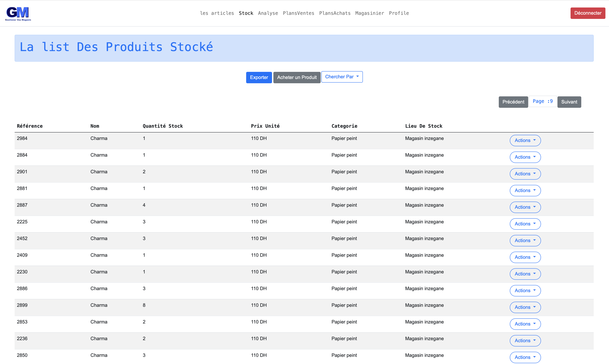
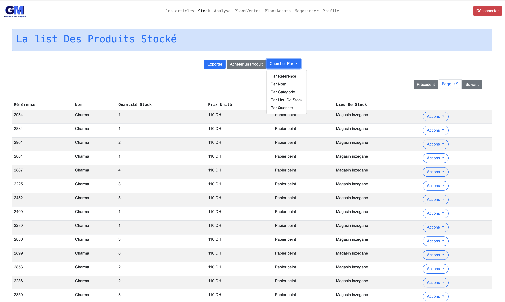
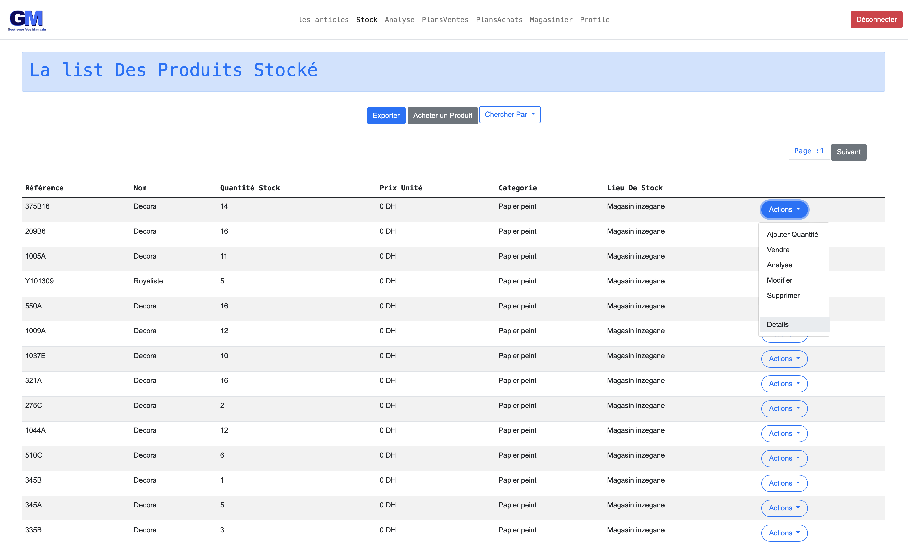
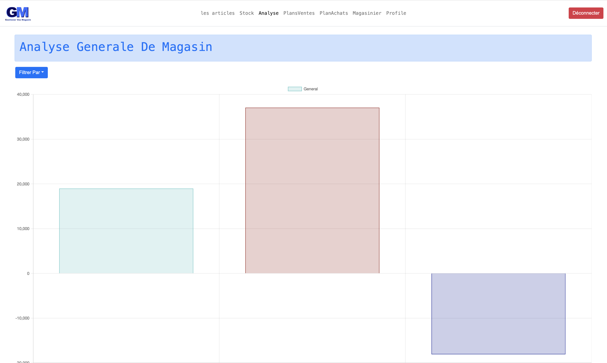
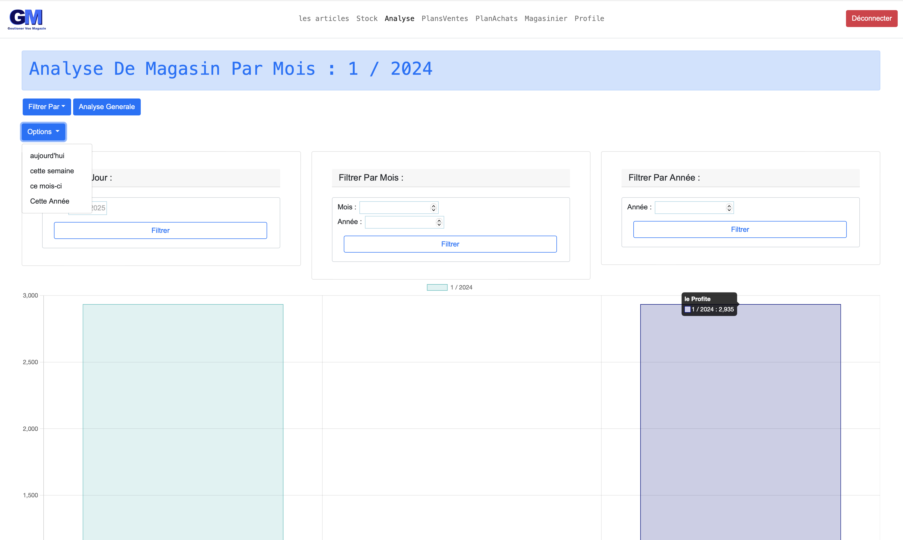
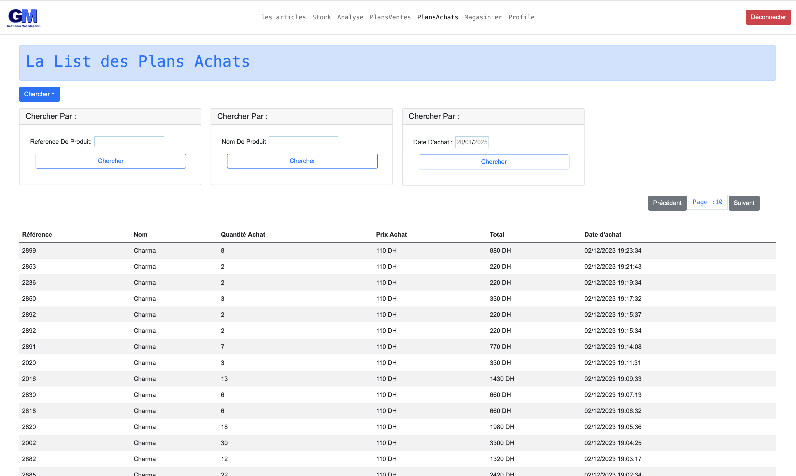
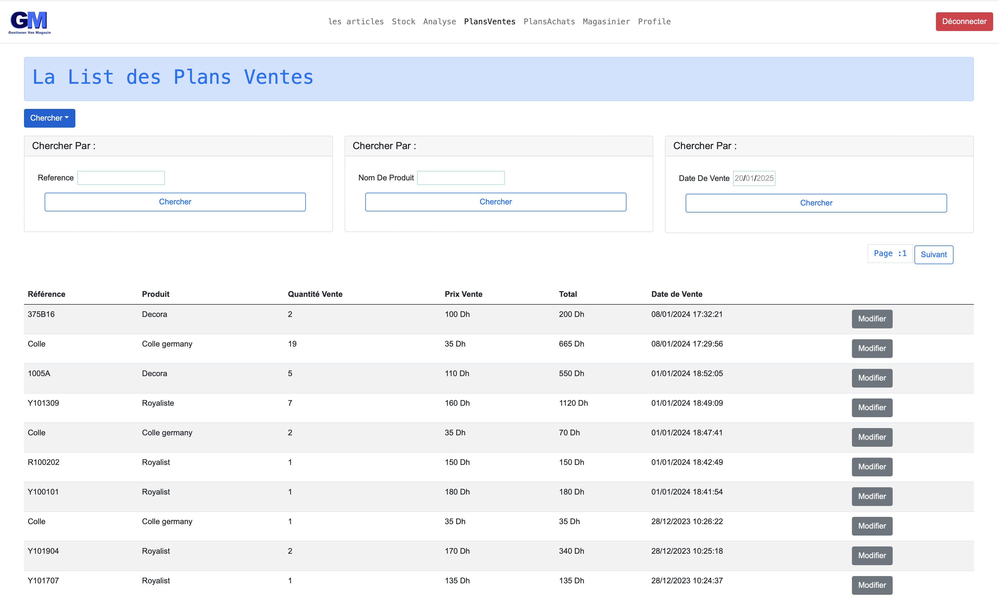
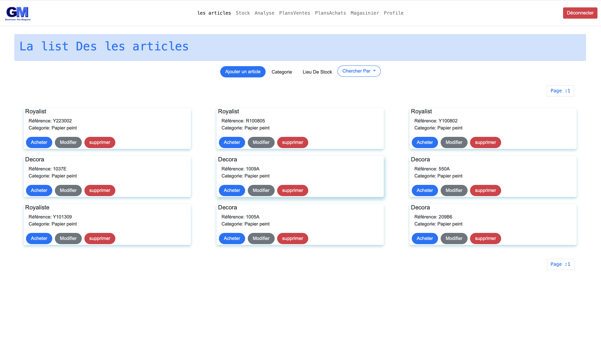

GSTMagazin est une application web "**ASP.NET Core**"  complète conçue pour rationaliser et améliorer la gestion des magasins de détail. Que vous exploitiez une petite boutique ou une grande chaîne de magasins, GSTMagazin offre des outils intuitifs pour simplifier les opérations quotidiennes et augmenter la productivité.  

Note : Ceci est personnalisé en fonction de la demande du client, sans gestion des vendeurs et des commandes. Le magasinier fait ce que le vendeur devrait faire.  

### Technologies Utilisées:

-  **ASP.NET Core MVC**  
-  **Entity Framework Core**  
-  **SQL Server**  
-  **Chart.js**  
-  **jQuery**  
-  **JSON**  
-  **HTML**  
-  **CSS**  
-  **JavaScript**  
-  **Bootstrap**  

Pour une démo ou un test, n'hésitez pas à me contacter.

Visitez le site web ici : https://gstmag.azurewebsites.net/

-----------

## Page de Stock

## Stock avec Recherche

## Stock avec Actions

## Page d'Analyse

## Analyse avec Options de Filtrage

## Plan des Achats

## Plan des Ventes

## Les Articles

--------

GSTMagazin is a comprehensive web application designed to streamline and enhance retail store management. Whether you're operating a small boutique or a large retail chain, GSTMagazin offers intuitive tools to simplify daily operations and boost productivity.

## Note : This is customized based on the client's request, without seller and order handling. The storekeeper does what the seller should do. 

### Technologies Used:
- **ASP.NET Core MVC**
- **Entity Framework Core**
- **(SQL Server)**
- **Chart.js**
- **jQuery**
- **JSON**
- **HTML**
- **CSS**
- **JavaScript**
- **Bootstrap**

For demo or test, feel free to contact me.

 visit the  website in : https://gstmag.azurewebsites.net/

